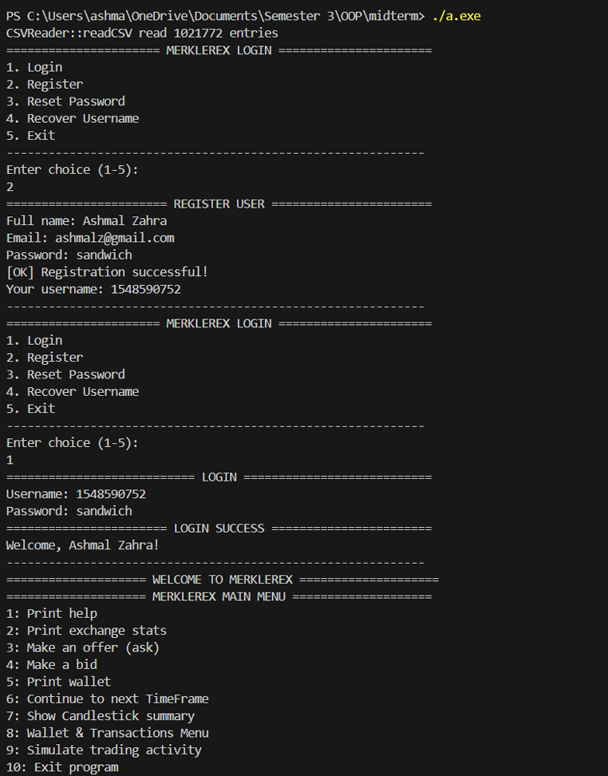

# 📈 Merklerex — C++ Trading Platform

> A console-based cryptocurrency trading platform built in C++ — featuring user authentication, OHLC candlestick analysis, a persistent per-user wallet, transaction history, and a realistic multi-day trading simulator.


---

## 📗 Table of Contents

- [📖 About the Project](#-about-the-project)
- [🗂 Project Structure](#-project-structure)
- [📄Project Demonstration](#-project-demonstration)
- [💻 Getting Started](#-getting-started)
  - [Prerequisites](#prerequisites)
  - [Building & Running](#building--running)
- [🕹 Menu Navigation](#-menu-navigation)
- [✨ Features](#-features)
  - [Task 1 — Candlestick Summary](#task-1--candlestick-summary)
  - [Task 2 — User Login & Registration](#task-2--user-login--registration)
  - [Task 3 — Wallet & Transaction History](#task-3--wallet--transaction-history)
  - [Task 4 — Trading Simulation](#task-4--trading-simulation)
  - [Task 5 — Input Validation & Menu System](#task-5--input-validation--menu-system)
- [📁 Data Files](#-data-files)
- [🔭 Possible Future Improvements](#-possible-future-improvements)
- [👤 Author](#-author)
- [🤝 Contributing](#-contributing)
- [📝 License](#-license)

---

## 📖 About the Project

**Merklerex** is an OOP midterm coursework project — a fully menu-driven cryptocurrency exchange simulator written in C++. It extends a provided order-book framework with five major features: candlestick OHLC analysis, a multi-user login system, a persistent per-user wallet, full transaction history with activity summaries, and a realistic multi-day trading simulator.

All data is persisted across runs using flat CSV files (`users.csv`, `wallets.csv`, `transactions.csv`). The market dataset (`20200601.csv`) serves as historical order-book data; simulated trades are stamped with the current system date and layered on top as fresh activity.

The program is built around the OOP lifecycle pattern — every feature is separated into its own class with a clear responsibility, and input robustness is handled centrally through a `UIHelpers` module reused across all menus.

---

## 🗂 Project Structure

```
merklerex/
│
├── MerkelMain.cpp/.h           # Main controller — menu routing, login flow, trading ops
├── OrderBook.cpp/.h            # Order book — stores and matches bid/ask entries
├── OrderBookEntry.cpp/.h       # Data model for a single market order
│
├── CandlestickCalculator.cpp/.h  # OHLC computation (daily / monthly / yearly)
├── Candlestick.cpp/.h            # Candlestick data model + formatted row output
├── DateUtils.cpp/.h              # Date validation, extraction, and range checking
│
├── UserManager.cpp/.h          # User registration, login, password hashing, CSV persistence
├── User.h                      # User data model (username, fullName, email, passwordHash)
│
├── Wallet.cpp/.h               # Per-user wallet — balance map, deposit/withdraw, CSV persistence
├── TransactionManager.cpp/.h   # Transaction logging, history views, activity summary
│
├── UIHelpers.cpp/.h            # Centralised input helpers (readIntInRange, readDouble, readString)
├── CSVReader.cpp/.h            # CSV parsing and tokenisation utilities
│
└── data/
    ├── 20200601.csv            # Historical market dataset (1,021,772 entries)
    ├── users.csv               # Registered users (auto-generated)
    ├── wallets.csv             # Per-user wallet balances (auto-generated)
    └── transactions.csv        # Full transaction log (auto-generated)
```

---

## 📄 Project Demonstration



[📄 Full Project Report](docs/oop-trading-system-report.pdf)

---

## 💻 Getting Started

### Prerequisites

- A C++17-compatible compiler (g++, clang++, or MSVC)
- The market dataset file `20200601.csv` placed in the project root

### Building & Running

**Linux / macOS**

```bash
# Compile all source files
g++ -std=c++17 -o merklerex *.cpp

# Run
./merklerex
```

**Windows (MinGW)**

```bash
g++ -std=c++17 -o merklerex.exe *.cpp
./merklerex.exe
```

**Windows (MSVC)**

```bash
cl /std:c++17 /EHsc *.cpp /Fe:merklerex.exe
merklerex.exe
```

> **Note:** `users.csv`, `wallets.csv`, and `transactions.csv` are created automatically on first run in the working directory. Do not delete them between runs if you want to preserve user accounts and transaction history.

---

## 🕹 Menu Navigation

```
[Launch] → MERKLEREX LOGIN
           ├── 1. Login
           ├── 2. Register
           ├── 3. Reset Password
           ├── 4. Recover Username
           └── 5. Exit

[Login Success] → MERKLEREX MAIN MENU
           ├── 1. Print help
           ├── 2. Print exchange stats
           ├── 3. Make an offer (ask)
           ├── 4. Make a bid
           ├── 5. Print wallet
           ├── 6. Continue to next TimeFrame
           ├── 7. Show Candlestick summary ──→ Product select → [Daily/Monthly/Yearly/Range/Change/Exit]
           ├── 8. Wallet & Transactions ──────→ [Balance/Deposit/Withdraw/Transactions/Summary/Back]
           ├── 9. Simulate trading activity
           └── 10. Exit program
```

---

## ✨ Features

<h3 id="task-1--candlestick-summary">Task 1 — Candlestick Summary</h3>

OHLC (Open / High / Low / Close) candlestick analysis for any market pair in the dataset, computed from ask and bid sides separately.

**How it works:**
- The user selects a product from a numbered list (e.g. BTC/USDT, ETH/BTC)
- The program immediately displays a **Yearly summary** as the default view
- An Additional Options menu then lets the user switch between:
  - Daily summary
  - Monthly summary
  - Yearly summary
  - Date Range filter (validated `YYYY-MM-DD` input with min/max bounds shown)
  - Change Product
  - Exit Candlestick View

**Implementation highlights:**
- `CandlestickCalculator` groups entries by a time key (first 10 / 7 / 4 characters of timestamp for day / month / year), normalises `/` separators to `-`, sorts each bucket by timestamp, then computes Open (first price), Close (last price), High and Low (full scan)
- OHLC values are printed to **10 decimal places** to avoid rounding away small price differences that would make candles look identical
- `DateUtils` validates date format, extracts day strings, and checks `isWithinRange()` for the filter
- After simulation (Task 4), simulated trades are merged into the candlestick input set via `TransactionManager::getTradesAsOrderBookEntries()`, so daily candles correctly reflect multi-day activity

**Key classes:** `CandlestickCalculator`, `Candlestick`, `DateUtils`

---

<h3 id="task-2--user-login--registration">Task 2 — User Login & Registration</h3>

A full authentication system that gates the main menu — the user cannot access any trading features without logging in first.

**Login Menu options:**
1. Login
2. Register
3. Reset Password
4. Recover Username
5. Exit

**Registration flow:**
- Collects full name, email, and password
- Validates email format (must contain `@` and a dot after it)
- Prevents duplicate accounts by checking full name + email case-insensitively
- Hashes the password using `std::hash<std::string>` — the plain text password is **never stored**
- Generates a unique **10-digit numeric username**, regenerating on collision
- Appends the new user to `users.csv` and creates an entry in `wallets.csv`

**Login flow:**
- Accepts username + password, hashes the input, compares against the stored hash
- On success, loads the wallet scoped to that username
- On failure, prints an error and loops — the program never exits or crashes on bad credentials

**Forgot details support:**
- **Recover Username** — user enters their registered email; if found, their username is displayed
- **Reset Password** — user enters email + a new password; the hash is updated in `users.csv`

**Key classes:** `UserManager`, `User`

---

<h3 id="task-3--wallet--transaction-history">Task 3 — Wallet & Transaction History</h3>

A persistent per-user wallet and full transaction history, accessible from the **Wallet & Transactions** submenu (option 8 on the main menu).

**Wallet & Transactions Menu options:**
1. View Wallet Balance
2. Deposit Funds
3. Withdraw Funds
4. View Transactions
5. Activity Summary
6. Back

**Wallet:**
- Balances are stored in a `map<string, double>` (currency → amount) and keyed to the logged-in username
- `Wallet::loadFromCSV(username)` loads only that user's rows; `Wallet::saveToCSV()` rewrites the file safely — preserving other users' rows and replacing only the current user's entries
- Deposit validates amount > 0; Withdraw checks the balance is sufficient before proceeding — both save to `wallets.csv` and log a transaction immediately

**Transaction log:**
- Each `Transaction` struct stores: `username`, `type`, `asset`, `amount`, `value`, `timestamp`
- All transactions append to `transactions.csv` with the username included, so the file holds multiple users' histories while still allowing user-scoped filtering
- Trading events are also logged: ask/bid placements and matched trade executions both write to `transactions.csv`

**View Transactions sub-menu:**
- **Last 5** — iterates backwards through the list, newest first, filtered to current user
- **By product** — builds a unique product list from user's history; user selects one to filter by
- **All transactions** — prints the complete user-scoped history

**Activity Summary:**
- Timeframe displayed as earliest → latest user transaction timestamp
- Shows total asks and bids placed, money spent / received per quote currency (USDT or BTC), net change from trading, deposits and withdrawals, and a per-product breakdown

**Key classes:** `Wallet`, `TransactionManager`

---

<h3 id="task-4--trading-simulation">Task 4 — Trading Simulation</h3>

A realistic multi-day trading simulator (option 9 on the main menu) that generates order activity using the current system timestamp, executes matched trades, updates balances, and persists everything to CSV.

**Why multi-day:** The simulator deliberately spreads activity across **5 days × 2 ticks** per product. This produces multiple daily candle rows in the candlestick view instead of a single burst, which makes the daily summary and date-range filter actually meaningful to demonstrate.

**Price generation:**
- Anchors each product's mid-price to real market context: takes the lowest ask (`marketNow`) at the current timeframe and samples the next timeframe (`marketNext`) to estimate a short-term trend
- `trend = clamp((marketNext − marketNow) / marketNow)` — clamped to prevent unrealistic jumps
- Each tick applies `mid = marketNow × (1 + dayDrift + noise)` — trend-based drift over 5 days plus small random noise to prevent flat lines
- A bid-ask spread of ±0.1% is applied around `mid` so ASK and BID candle series remain distinct

**Order matching guarantee:**
- User BID is placed slightly above `marketAsk`; the matching dataset ASK is placed at `marketAsk` — so the bid always crosses the ask and executes
- Equivalent logic for user ASK / dataset BID on sell ticks

**Wallet safety:**
- Checks available quote or base currency before placing each order; switches buy↔sell if one side has no balance, or skips if neither is available
- Sizes orders down to the maximum safe amount (`balance × 0.999`) rather than failing — console prints `[ADJUST]` messages when this happens
- `wallet.processSale(sale)` updates balances only for trades attributed to the logged-in user

**Duplicate protection:**
- On re-run, the program detects existing simulation transactions for the user and asks for confirmation before running again — preventing `transactions.csv` from being cluttered with repeated simulation blocks

**Historical vs simulated data:**
- Dataset records stay grouped under their original 2020 dates; simulated records appear under 2025 buckets — they coexist without mixing, so the date-range filter and yearly candlestick view correctly show both periods separately

**Key classes:** `MerkelMain::simulateTradingActivity()`, `TransactionManager`, `Wallet`

---

<h3 id="task-5--input-validation--menu-system">Task 5 — Input Validation & Menu System</h3>

Centralised, robust input handling that ensures no invalid input can crash the program, break the `cin` stream, or unexpectedly exit a menu.

**`UIHelpers` module:**

| Function | Behaviour |
|---|---|
| `UI::readIntInRange(min, max)` | Loops until a valid integer within range is entered; clears `cin` fail state and discards the line on bad input |
| `UI::readDouble()` | Reads a full line and converts with `stod` inside a `try/catch` — typed text like `"abc"` prints an error and prompts again without breaking the stream |
| `UI::readString(prompt)` | Safe line input with a prompt |

**Menu loop design:**
- `loginMenu()` — repeats until login succeeds or the user explicitly exits
- `init()` — main menu loop repeats until option 10 (Exit) is chosen
- `TransactionManager::showMenu()` — wallet/transactions menu repeats until Back
- No menu exits due to a mistaken input — the user is always kept inside the active context

**Domain validation beyond type checking:**
- Withdrawal validates the amount against available balance before attempting removal
- Date range input validates format, logical order (end ≥ start), and bounds against the available min/max from the dataset
- Product selection uses a numbered list so the user never types a raw product string
- Deposit rejects amounts ≤ 0

**Key classes:** `UIHelpers`, `MerkelMain`, `TransactionManager`

---

## 📁 Data Files

| File | Created by | Purpose |
|---|---|---|
| `20200601.csv` | Provided dataset | Historical market orders (1,021,772 entries, June 2020) |
| `users.csv` | Auto-generated | Registered user accounts (username, name, email, password hash) |
| `wallets.csv` | Auto-generated | Per-user currency balances |
| `transactions.csv` | Auto-generated | Full user transaction log (deposits, withdrawals, bids, asks, matched trades) |

**Supported trading pairs:** BTC/USDT · DOGE/BTC · DOGE/USDT · ETH/BTC · ETH/USDT

---

## 🔭 Possible Future Improvements

- Replace `std::hash<std::string>` with a cryptographic hash (e.g. bcrypt or SHA-256) for production-grade password security
- Add a price chart rendered in ASCII/unicode to the candlestick view
- Support live market data via an API instead of a static CSV dataset
- Add order cancellation before the next timeframe advances
- Export transaction history and activity summary to a formatted PDF or CSV report
- Add a portfolio performance view (profit/loss over time)

---

## 👤 Author

👤 **Ashmal Zahra**

- GitHub: [@ashmalzahra](https://github.com/ashmalzahra)
- Twitter: [@AshmalZahraa](https://twitter.com/AshmalZahraa)
- LinkedIn: [ashmal-zahra](https://www.linkedin.com/in/ashmal-zahra)

---

## 🤝 Contributing

Contributions, issues, and feature requests are welcome!

Feel free to check the [issues page](https://github.com/ashmalzahra/cpp-trading-simulator/issues).

---

## 📝 License

This project is [MIT](./LICENSE) licensed.

---


<p align="center">Built in C++ · OOP Architecture · CSV Persistence · Console UI</p>